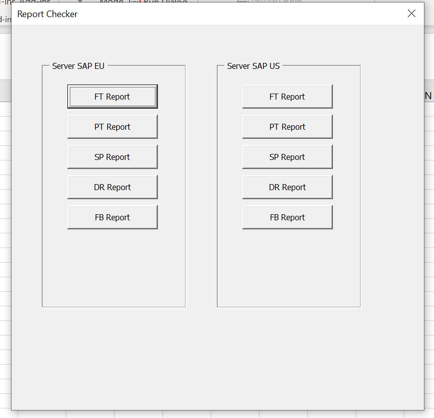
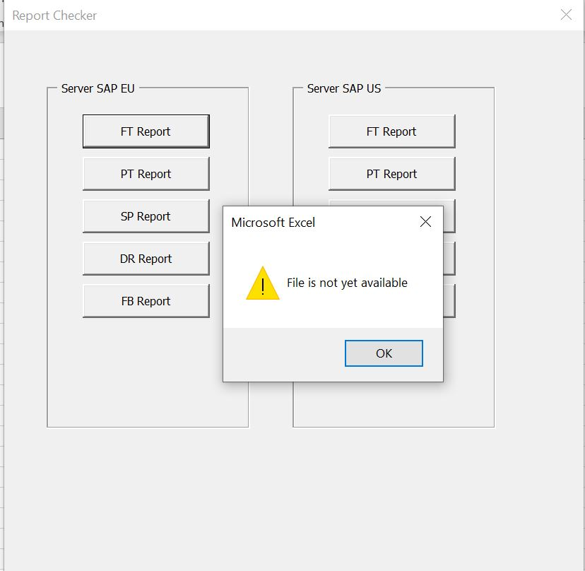
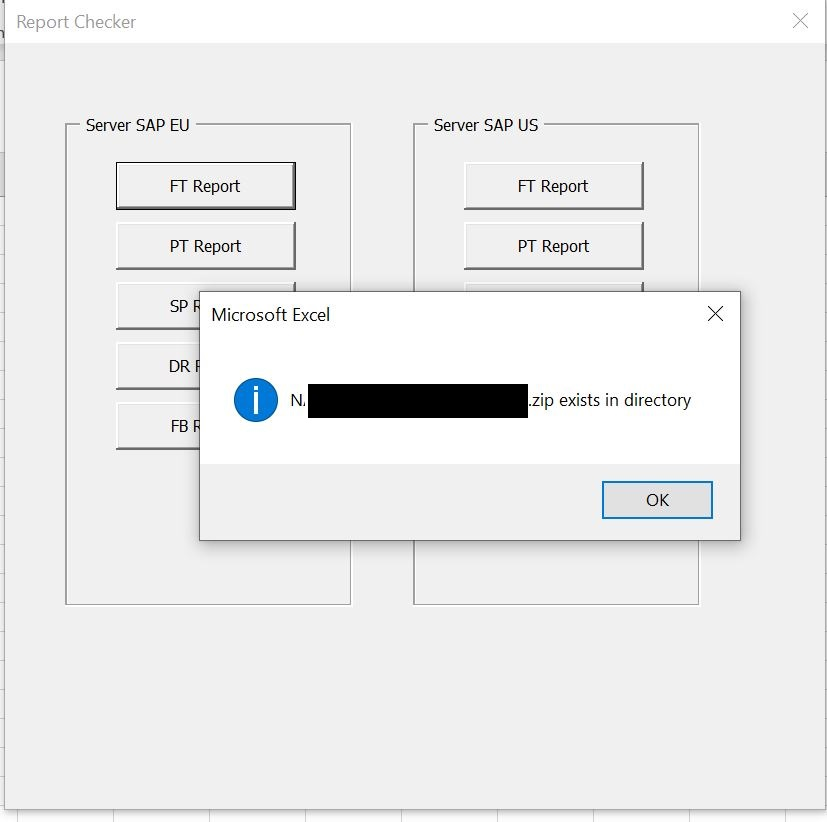

# Tool to Check-if-files-are-available
 
The purpose of this tool is to very quickly check if files are available in different directories.
I use it in my work to "get" files/reports that are automatically generated by our systems and saved in different locations on different servers.
As the time to generate these reports may widely change from a day to another and also the previous versions of these reports remain in the directories, checking each directory regularly and individually was sometimes time consuming... So I developed this little tool to optimize my time.

This version is deliberately a demo version. the real data was removed and you will need to modify the code to adapt it for your use. Read comments in code!

 

 

 

